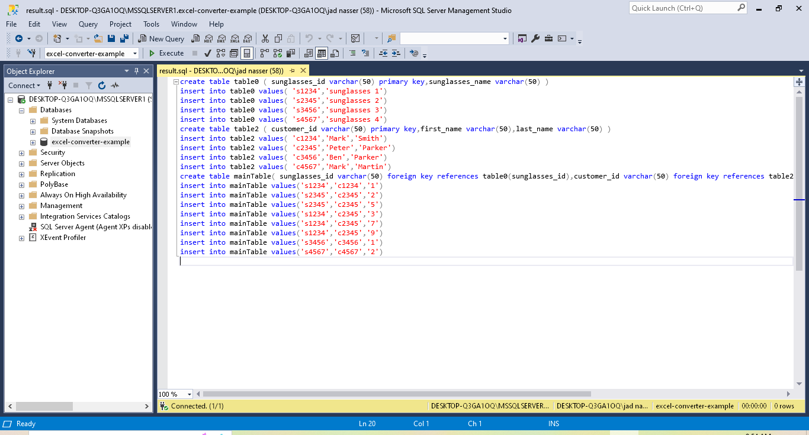
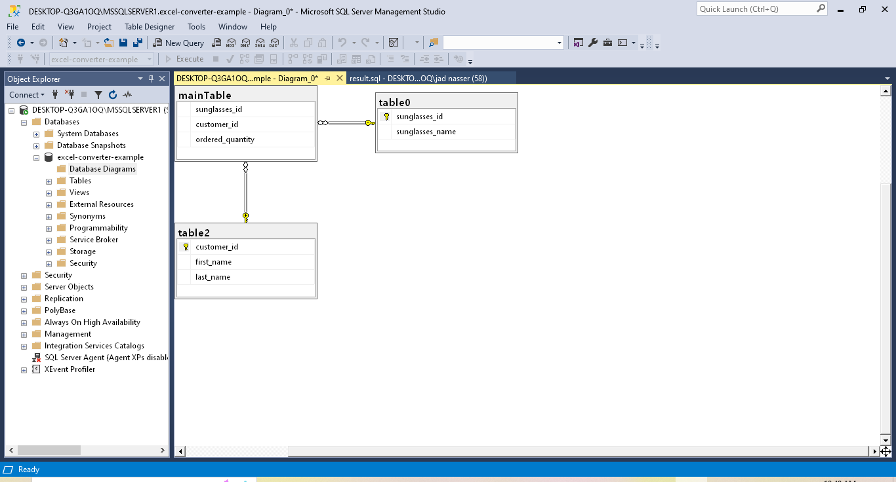

# **From Excel to Relational Database Converter**

 
 

## **Overview**

 

This is my university graduation project, but I've updated its dependencies and modified its files structure and code structure for better code readability.

This project provides converting a Microsoft Excel table to a Microsoft SQL Server relational database by reading the Excel file table and discovering the relationships between the columns of this table, then returns a file that contains SQL queries and when this file is executed in a SQL Server database it will generates a 2NF (Second Normal Form) relational database of the input Excel file with less data repetition.

 
 

## **Technologies Used**

 

- **Java**
- **Apache POI 5.2.2**: Used for reading Microsoft Excel file data in Java.

 
 

## **Algorithm Explanation**

 

We will discuss how the algorithm of this app works step by step:

### **1. Reading the data from the Excel file**

In the whole section we will use the table belows as an example to explain the algorithm and we will suppose that this table represents the data in an Excel file. The table below represents customers buying sunglasses.

| sunglasses-id | sunglasses-name | customer-id | first-name | last-name | ordered-quantity |
| ------------- | --------------- | ----------- | ---------- | --------- | ---------------- |
| s1234         | sunglasses 1    | c1234       | Mark       | Smith     | 1                |
| s2345         | sunglasses 2    | c2345       | Peter      | Parker    | 2;5              |
| s1234         | sunglasses 1    | c2345       | Peter      | Parker    | 3 ; 7 , 9        |
| s3456         | sunglasses 3    | c3456       | Ben        | Parker    | 1                |
| s4567         | sunglasses 4    | c4567       | Mark       | Martin    | 2                |

 

The algorithm will start collecting the data from the given Excel file and clean it and correct column names.

In this app cleaning means removing unnecessary spaces, converting commas to semicolons, and removing unnecessary semicolons for example in the third row the ordered_quantity value is "3 ; 7 , 9" that contains a comma that should be a semicolon and also it contains some unnecessary spaces around the comma and the semicolon, so after cleaning the value will be "3;7;9".

The algorithm will correct column names by replacing each space and "-" with "\_" for example "sunglasses-id" column name will become "sunglasses_id"

After reading and cleaning each cell value and correcting column names a data matrix will be returned and its shape is as the table below.

| sunglasses_id | sunglasses_name | customer_id | first_name | last_name | ordered_quantity |
| ------------- | --------------- | ----------- | ---------- | --------- | ---------------- |
| s1234         | sunglasses 1    | c1234       | Mark       | Smith     | 1                |
| s2345         | sunglasses 2    | c2345       | Peter      | Parker    | 2;5              |
| s1234         | sunglasses 1    | c2345       | Peter      | Parker    | 3;7;9            |
| s3456         | sunglasses 3    | c3456       | Ben        | Parker    | 1                |
| s4567         | sunglasses 4    | c4567       | Mark       | Martin    | 2                |

 

### **2. Converting the data matrix to 1NF**

Now the algorithm will convert the data to 1NF. 1NF means First Normal Form and a table is in 1NF if it has the following conditions:

- A field in the table should not have multiple values.
- No dublicated rows
- Columns names should be unique

If the program detects empty fields or columns with the same name the algorithm process will stop and the program will send a message to the user.

If the program detects a row that have fields with multiple values that row will be replaced by number of rows that it is equals to a \* b \* c \* ... where each of a,b, and c represents the number of values in a field and the new rows don't contains any field with multiple values, for example if we have a row that contains a field that contains 2 values and another field that contains 3 values, that row will be replaced by 2 \* 3 = 6 rows.

In our data matrix we have the ordered_quantity field of row 2 and row 3 containing multiple values separated by semicolons, so row 2 will be replaced by these rows:

| sunglasses_id | sunglasses_name | customer_id | first_name | last_name | ordered_quantity |
| ------------- | --------------- | ----------- | ---------- | --------- | ---------------- |
| s2345         | sunglasses 2    | c2345       | Peter      | Parker    | 2                |
| s2345         | sunglasses 2    | c2345       | Peter      | Parker    | 5                |

 

The same thing will happen to the third row which will be replaced by 3 rows.

If the programs detects dublicated rows in the data matrix it will delete the duplicated rows. In our example there are no duplicated row.

After all the 1NF condition is applied the program will return the 1NF data matrix that contains the table in 1NF. In our example the result 1NF data matrix will be as the table below.

| sunglasses_id | sunglasses_name | customer_id | first_name | last_name | ordered_quantity |
| ------------- | --------------- | ----------- | ---------- | --------- | ---------------- |
| s1234         | sunglasses 1    | c1234       | Mark       | Smith     | 1                |
| s2345         | sunglasses 2    | c2345       | Peter      | Parker    | 2                |
| s2345         | sunglasses 2    | c2345       | Peter      | Parker    | 5                |
| s1234         | sunglasses 1    | c2345       | Peter      | Parker    | 3                |
| s1234         | sunglasses 1    | c2345       | Peter      | Parker    | 7                |
| s1234         | sunglasses 1    | c2345       | Peter      | Parker    | 9                |
| s3456         | sunglasses 3    | c3456       | Ben        | Parker    | 1                |
| s4567         | sunglasses 4    | c4567       | Mark       | Martin    | 2                |

 

### **3. Getting the 2NF relational matrix**

Now the algorithm will convert the 1NF data matrix to 2NF by returning the 2NF relational matrix. 2NF means Second Normal Form and a table is in 2NF if it has the following conditions:

- Table should be in 1NF
- Every dependent column key is dependent on the primary key of the table, so if we have a dependent column key in the 1NF table another table should be created that contains the dependent column and the primary key column that the dependent column is depends on, and we should remove the dependent column from the main table and the primary key column should only left in the main table as foreign key to the created table.

2NF relational matrix is a matrix of size n\*n that contains values of booleans where n is the number of columns of the 1NF data matrix. The aim of the relational matrix is to describe the dependency relationships between the columns of the 1NF data matrix, so for example if a value at index(1,3) is true that means that column 3 is dependent on column 1 and if the value is false that means that column 3 is not dependent on column 1. At initial all the values of the relational matrix are true except the values at the diagonal are false because a column can't be dependent on itself. Initially in our example the 2NF relational matrix will be as the table below.

| Depends On \ Dependent | sunglasses_id | sunglasses_name | customer_id | first_name | last_name | ordered_quantity |
| ---------------------- | ------------- | --------------- | ----------- | ---------- | --------- | ---------------- |
| **sunglasses_id**      | false         | true            | true        | true       | true      | true             |
| **sunglasses_name**    | true          | false           | true        | true       | true      | true             |
| **customer_id**        | true          | true            | false       | true       | true      | true             |
| **first_name**         | true          | true            | true        | false      | true      | true             |
| **last_name**          | true          | true            | true        | true       | false     | true             |
| **ordered_quantity**   | true          | true            | true        | true       | true      | false            |

 

In order the 2NF relational matrix to be completed the algorithm will compare every 2 rows to each other in the 1NF data matrix so we will show how to compare 2 rows by comparing 2 rows from our example table:

 

| sunglasses_id | sunglasses_name | customer_id | first_name | last_name | ordered_quantity |
| ------------- | --------------- | ----------- | ---------- | --------- | ---------------- |
| **s1234**     | sunglasses 1    | c1234       | Mark       | Smith     | 1                |
| **s1234**     | sunglasses 1    | c2345       | Peter      | Parker    | 3                |

We started comparing the two rows above with each other by starting from sunglasses_id column and in this case the two sunglasses_id values are equal so we keep the sunglasses_id values marked and we start comparing all the other column values.

 

| sunglasses_id | sunglasses_name  | customer_id | first_name | last_name | ordered_quantity |
| ------------- | ---------------- | ----------- | ---------- | --------- | ---------------- |
| **s1234**     | **sunglasses 1** | c1234       | Mark       | Smith     | 1                |
| **s1234**     | **sunglasses 1** | c2345       | Peter      | Parker    | 3                |

Here the two sunglasses_name values are equal so nothing will happen so moving to the other column.

 

| sunglasses_id | sunglasses_name | customer_id | first_name | last_name | ordered_quantity |
| ------------- | --------------- | ----------- | ---------- | --------- | ---------------- |
| **s1234**     | sunglasses 1    | **c1234**   | Mark       | Smith     | 1                |
| **s1234**     | sunglasses 1    | **c2345**   | Peter      | Parker    | 3                |

Here we find that the two customer_id values are different so now we have discovered that customer_id column is not dependent on sunglasses_id column so we change the relational matrix value at index(0,2) to false.

 

| sunglasses_id | sunglasses_name | customer_id | first_name | last_name | ordered_quantity |
| ------------- | --------------- | ----------- | ---------- | --------- | ---------------- |
| **s1234**     | sunglasses 1    | c1234       | **Mark**   | Smith     | 1                |
| **s1234**     | sunglasses 1    | c2345       | **Peter**  | Parker    | 3                |

Here the as above the two first_name values are different so change the relational matrix at index(0,3) to false.

 

| sunglasses_id | sunglasses_name | customer_id | first_name | last_name  | ordered_quantity |
| ------------- | --------------- | ----------- | ---------- | ---------- | ---------------- |
| **s1234**     | sunglasses 1    | c1234       | Mark       | **Smith**  | **1**            |
| **s1234**     | sunglasses 1    | c2345       | Peter      | **Parker** | **3**            |

The same will be applied to the last_name and ordered_quantity columns and the relational matrix values at index(0,4) and index(0,5) will set to false.

 

| sunglasses_id | sunglasses_name  | customer_id | first_name | last_name | ordered_quantity |
| ------------- | ---------------- | ----------- | ---------- | --------- | ---------------- |
| s1234         | **sunglasses 1** | c1234       | Mark       | Smith     | 1                |
| s1234         | **sunglasses 1** | c2345       | Peter      | Parker    | 3                |

Now after comparing all the columns we remove the marking from sunglasses_id values to sunglasses_name values and here the two sunglasses_name values are equal so we will start again comparing all the columns to each other as same as happed to sunglasses_id column and the relational matrix values at indexes (1,2) , (1,3) , (1,4) , (1,5) will all be set to false.

 

| sunglasses_id | sunglasses_name | customer_id | first_name | last_name | ordered_quantity |
| ------------- | --------------- | ----------- | ---------- | --------- | ---------------- |
| s1234         | sunglasses 1    | **c1234**   | Mark       | Smith     | 1                |
| s1234         | sunglasses 1    | **c2345**   | Peter      | Parker    | 3                |

Now after comparing all the columns we remove the marking from sunglasses_name values to customer_id values but here the two customer_id values are different so we remove the marking instantly from the customer_id values to the next column values.

 

| sunglasses_id | sunglasses_name | customer_id | first_name | last_name  | ordered_quantity |
| ------------- | --------------- | ----------- | ---------- | ---------- | ---------------- |
| s1234         | sunglasses 1    | c1234       | **Mark**   | **Smith**  | **1**            |
| s1234         | sunglasses 1    | c2345       | **Peter**  | **Parker** | **3**            |

The same as happened above for customer_id column they are all different and nothing will happen, and then the comparison process of that two rows is completed.

 

After comparing every two rows in the 1NF data matrix the 2NF relational matrix will be as the table below.

| Depends On \ Dependent | sunglasses_id | sunglasses_name | customer_id | first_name | last_name | ordered_quantity |
| ---------------------- | ------------- | --------------- | ----------- | ---------- | --------- | ---------------- |
| **sunglasses_id**      | false         | true            | false       | false      | false     | false            |
| **sunglasses_name**    | true          | false           | false       | false      | false     | false            |
| **customer_id**        | false         | false           | false       | true       | true      | false            |
| **first_name**         | false         | false           | false       | false      | false     | false            |
| **last_name**          | false         | false           | false       | false      | false     | false            |
| **ordered_quantity**   | false         | false           | false       | false      | false     | false            |

 

In this algorithm a two columns can't be dependent to each other, so the algorithm will check every index in the relational matrix and if a value at index(x,y) is true then the algorithm will set the value at index(y,x) to false, so after this step is applied in our example the final shape of the relational matrix will be as the table below.

| Depends On \ Dependent | sunglasses_id | sunglasses_name | customer_id | first_name | last_name | ordered_quantity |
| ---------------------- | ------------- | --------------- | ----------- | ---------- | --------- | ---------------- |
| **sunglasses_id**      | false         | true            | false       | false      | false     | false            |
| **sunglasses_name**    | **false**     | false           | false       | false      | false     | false            |
| **customer_id**        | false         | false           | false       | true       | true      | false            |
| **first_name**         | false         | false           | false       | false      | false     | false            |
| **last_name**          | false         | false           | false       | false      | false     | false            |
| **ordered_quantity**   | false         | false           | false       | false      | false     | false            |

 

### **4. Writing the SQL Server queries to the destination file**

After getting the 2NF relational matrix now the program is ready to write the queries file. This file contains SQL Server queries that needed to be executed in a SQL Server database to create the 2NF relational database with the tables data.

There are two types of table:

- Main table: this table don't contain any dependent column but it contains two types of columns:
  - A column that has other columns dependent on it, this column will have a table of its own and in this table this column will be a foriegn key referencing to its own table
  - A column that is not dependent to any other column at the same time this does not have any other column dependent on it, this column will not have a table of its own.
- Normal table: this table contains columns that are dependent to a column and this column is also contained in the table as the primary key.

So in our example sunglasses_id and customer_id columns each of them will have a table of its own because they are not dependent to any other column and at the same time they have other columns that are depending to them, and also they will be presented in the main table as foreign keys that referencing to their own table.

sunglasses_name column is dependent to sunglasses_id column so it will not present in the main table but it will presents in sunglasses_id table.

first_name and last_name columns are dependent to customer_id column so they will not present in the main table but they will presents in customer_id table.

ordered_quantity column is not dependent to any other column but it will not have its own table because there are no other columns depending on this column, but this column will be presented in the main table.

After the algorithm detects that informations the SQL queries file will be generated in a given destination that contains the create tables and insert data queries.

 
 

## **Project Files Structure**

 

- **lib**: contains Apache POI library jar files.
- **src**: contains all source packages of the project
  - **main**: contains the Java class that has the main method to run the program.
  - **gui**: contains all the Java classes that are related to the GUI of this app.
    - **MainFrame.java**: the class that holds the entire frame of the app.
    - **SelectExcelFile.java**: responsible for interacting with the user to select the Microsoft Excel file.
    - **CreateQueriesFile.java**: responsible for interacting with the user to select the destination file of the result queries file and creating it.
  - **core**: contains all the java classes that are related to functionality of this app.
    - **Engine.java**: the class that makes all the other classes in this package to work as one part to get the desired result.
    - **ReadExcel.java**: responsible for using the Apache POI api to get the data from a given Microsoft Excel file.
    - **FirstNormalForm.java**: responsible for coverting the data to 1NF.
    - **SecondNormalForm.java**: responsible for converting 1NF data to 2NF and creating a file in a given destination that contains SQL queries, this file needed to be executed in an Microsoft SQL Server database in order to get the 2NF relational database.

 
 

## **How to Use The App**

 

We will show how to use the app step by step:

After launching the app a page will appear that says "Select an Excel file".

Click the "Browse" button and a file chooser will apear, choose an Excel file with .xlsx extention, then click "open" button in the file chooser. In our example we select "example-sheet.xlsx" you can find this file in the repository.

After selecting the Excel file the page will change and a new page will appear that says "Where you want to save the result file?".

You can click the "Back" button to go to the previous page and select another Excel file

Click the "Browse" button and a file chooser will apear, choose the location you need the queries file to be created, then type any name you need for that file and click "save" button in the file chooser. In our example we named the file "result.sql".

After clicking the save button wait few second and if the Excel file data is in a good form a message box will appear above the page that says "The file successfully created".

If the Excel file data is not in good format like having column/row spans, dublicated column name, empty data fields, or empty Excel file a message box will appear that tells the user.

After the queries file is created, if you are not yet created a database to execute that file in it, open Microsoft SQL Server and create a database.

Now open the created file in SQL Server program, our created result.sql file is shown in the image below.

**Note**: tables are named based on their column position in the Excel file not based on their number so thats why in the image above we have "table0" and "table2" but don't have "table1".

Now in order to create the relational database, execute the file in the SQL Server program. After the file is successfully executed the SQL Server program will show a success message in the bottom like the image below.

In our example the created 2NF relational database from "example-sheet.xlsx" Excel file is shown in the image below.

 
 

---
